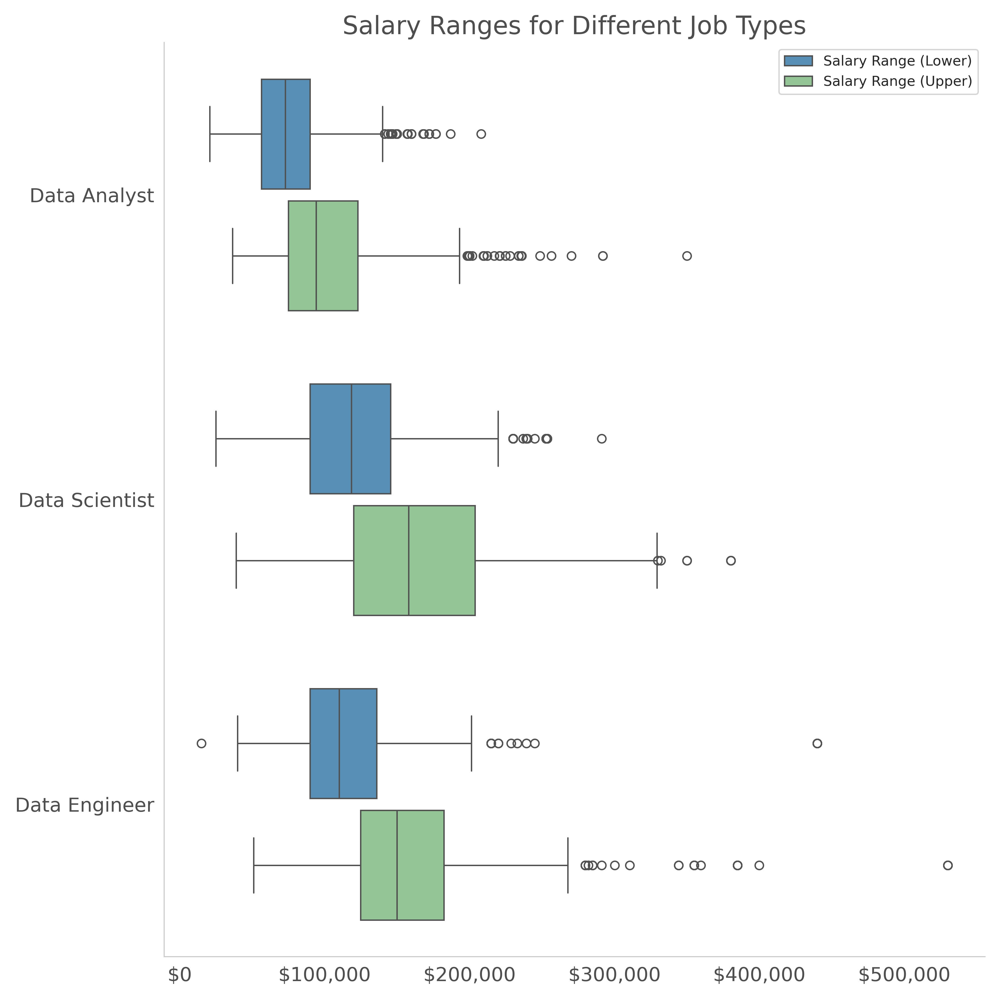

# 📊 Data Jobs Web Scraper 🕸️

Welcome to the **Data Jobs Web Scraper** project! This project is designed to analyze data jobs, their locations, salaries, and the key skills required. 🚀

## 🌟 Introduction

Finding the right data job can be overwhelming given the vast amount of information available online. This project aims to simplify the process by scraping job postings and analyzing key aspects such as:
- Job locations 🗺️
- Salary ranges 💰
- Required skills 🛠️

By providing these insights, we hope to help aspiring data scientists and analysts understand the job market better and tailor their skills accordingly.

## ✨ Features

- **Web Scraping**: Automatically collects job postings from various websites.
- **Data Analysis**: Analyzes job data to identify trends and key requirements.
- **Visualization**: Generates visual representations of the data for easier understanding.

## 🛠️ Installation

1. Clone the repository:
    ```bash
    git clone https://github.com/ColinB19/datajobswebscraper.git
    cd datajobswebscraper
    ```

2. Install the required packages:
    ```bash
    pip install -r requirements.txt
    ```

## 🚀 Usage

The scraper uses environment variables in a `.env` file to configure paths. You'll need a `DATA_PATH` for the scraped data and a `LOG_PATH` for the scraper logs. 

To get familiar with the data, please run through [HowTo-ScrapingDataJobs.ipynb](https://github.com/ColinB19/datajobswebscraper/blob/master/HowTo-ScrapingDataJobs.ipynb).

To utilize the full scraper, and visualize and analyze the data, please see [Webscrape_DataJobs.ipynb](https://github.com/ColinB19/datajobswebscraper/blob/master/Webscrape_DataJobs.ipynb)

If you would just like to run the scraper, please use the following snippit from [Webscrape_DataJobs.ipynb](https://github.com/ColinB19/datajobswebscraper/blob/master/Webscrape_DataJobs.ipynb):

```python
djs = DataJobsScraper(site="Indeed")
djs.scrape_jobs()
djs.scrape_job_text()
djs.clean_data()
djs.export_data(data_path=PATH)
```

## 🌐 Data Sources

We scrape job postings from a variety of websites, including but not limited to:
- [Indeed](https://www.indeed.com/)
- [DataJobs](https://datajobs.com/)

## 📊 Results

### **Job Locations**: Where are the most opportunities? 🗺️


### **Salary Ranges**: How much can you expect to earn? 💸


### **Key Skills**: What skills are in demand? 🛠️


